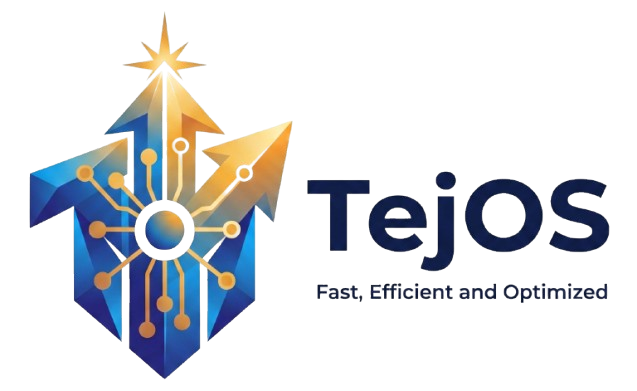

<div align="center">
  
  <p><b>Automated Lightweight Windows 11 Custom ISO Builder</b></p>
  <p><i>Windows 11 Debloat • TPM 2.0 & Secure Boot Bypass • Bloatware Removal • Zero-Touch Unattended Install</i></p>
  <p><b>An open-source tiny11 alternative — built with PowerShell + DISM</b></p>

  <p>
    
    
  </p>

  <p>
    <a href="https://t.me/TejOS11"></a>
  </p>
  <p><sub>Questions, hardware reports, or suggestions for what TejOS should support next? Drop them in the group.</sub></p>
  <h1>🚀 TejOS</h1>
</div>

## 🌟 What Is TejOS?

**TejOS is a fully automated PowerShell script that builds a debloated, optimized, lightweight Windows 11 custom ISO from Microsoft's official installation media.** If you've been searching for a **tiny11 alternative**, a **Windows 11 debloater**, or a way to build your own **Windows 11 lite ISO** without downloading a mystery file from a random site, this is that tool.

Using offline DISM servicing, TejOS **removes Windows 11 bloatware**, disables telemetry, aggressively reduces the **WinSxS component store**, **bypasses the TPM 2.0 / Secure Boot / CPU checks** via offline registry edits, and injects an `autounattend.xml` into the image for a **fully unattended ("zero-touch") Windows 11 install** — a local account is created automatically, no Microsoft account required, no OOBE questionnaires.

The output: an ultra-light **~2.7 GB Windows 11 ISO** (with ESD compression) that installs itself, boots fast, and runs on **old, low-end, and officially unsupported hardware** — 15-year-old PCs included.

> ⚠️ **Never download prebuilt "Windows 11 Lite ISO" files from random websites.** They are unofficial, unauditable, and a common malware vector. TejOS builds the same result **from your own official Microsoft ISO** — every line of the build is open source and runs 100% offline on your machine.


## ⚡ Key Features

- 🧹 **One-command Windows 11 debloat** — strips bloatware, telemetry services, background tasks, and preinstalled apps at the image level, not after install
- 🔓 **Bypass TPM 2.0, Secure Boot & RAM/CPU requirements** — install Windows 11 on unsupported and legacy hardware via offline registry edits baked into the image
- 🪶 **Aggressive WinSxS reduction** — component store significantly reduced (making the OS non-serviceable, but drastically smaller)
- 🤖 **Zero-touch unattended install** — built-in `autounattend.xml` handles the entire setup: local admin account, no Microsoft account required, no OOBE prompts
- 🗜️ **ESD / LZMS compression** — final ISO shrinks to ~2.7 GB (requires significant CPU/RAM during build)
- 🤫 **Invisible first-boot finishing touches** — disk optimization and live-only tweaks (CompactOS, shadow storage, IPv6, etc.) run hidden as SYSTEM before you ever see the desktop — no windows, no prompts
- 🧰 **Desktop toolkit** — a `TejOS-Tools` folder appears on the desktop after install with a browser installer (Brave / Firefox / Chrome / Edge) and a driver installer, run manually whenever you're ready
- 🧰 **100% offline, 100% open source** — PowerShell + DISM only; no binaries shipped, nothing downloaded, nothing uploaded
- 🎚️ **Four tiers** — from safe (Full) to surgical (Nano) to extreme (Micro)


## 📊 The Four Tiers of TejOS

| Version | Target Audience | What It Does | Status |
| : | : | : | : |
| **TejOS Full** | General users | Removes heavy telemetry & tracking; keeps Defender, Edge, Store, and Windows Update intact. | *Coming soon* |
| **TejOS Lite** | Gamers & power users | Removes Edge and OneDrive, trims background services, keeps Windows Update functional. | *Coming soon* |
| **TejOS Nano** | **Old hardware & VMs** | **The Shredder. Aggressively strips WinSxS, removes Windows Update/Defender entirely, bypasses all hardware checks.** | **🟢 Available now!** |
| **TejOS Micro** | Kiosks & retro builds | Maximum strip-down: removes the network stack and print spooler. Tiny RAM footprint. | *Coming soon* |


## 🔮 Tested on the Cutting Edge: Windows 11 Insider Preview

The current TejOS Nano release was built and validated specifically against **Windows 11 Insider Preview build 29648.1000**. It has **not** been tested against other ISOs — earlier builds, other channels, or stable releases — so treat anything outside that one build as unverified for now.

Which version(s) TejOS supports next isn't locked in yet. Rather than guess, we're going by what the community actually wants and reports back — so if you try Nano against a different ISO (working or not), or have an opinion on what should be supported next, share it in the [Telegram group](https://t.me/TejOS11). Future tiers and version support will be shaped by that feedback.


## ⚡ TejOS Nano: What Works & What Doesn't

TejOS Nano gets its speed by surgically removing large portions of the operating system at the image level. Some things are gone by design.

### ✅ What Works Perfectly
- **General computing:** web browsing, office work, media playback.
- **Third-party software:** Steam, Discord, Chrome, Brave, Adobe, etc.
- **Basic hardware:** keyboards, mice, and universal display drivers work out of the box.
- **Local accounts:** no forced Microsoft account sign-in, ever.

### ❌ What's Removed (And the Alternatives)
- **Windows Defender (removed)** → zero built-in antivirus for maximum CPU headroom. If you need real-time protection, install a lightweight third-party engine like **Bitdefender Free**, **Kaspersky Free**, or **Avira**.
- **Windows Update (removed)** → Nano is a **non-serviceable OS by design**. WinSxS is aggressively stripped, so future updates mean building a fresh TejOS ISO — the honest trade for a minimal component store. This is the same tradeoff as tiny11 Core.
- **Microsoft Edge & OneDrive (removed)** → use **Brave**/Chrome and Google Drive/Dropbox.

### ⚠️ Important Note on Drivers
To keep the ISO tiny, Nano slims the Microsoft Driver Store down to essential universal drivers.
- **Fact:** even a completely unmodified official Windows 11 ISO offers no guarantee that your specific hardware drivers work immediately after install.
- **The fix:** after installing TejOS, run the Driver Booster installer from the `TejOS-Tools` folder on your desktop, or download drivers from your motherboard/laptop manufacturer (see "After Installation" below).


## 📋 Requirements

- Windows 10 or 11 host, **PowerShell running as Administrator**
- An **official Windows 11 ISO** from Microsoft (any edition, including Insider Preview)
- ~30 GB free disk space · 8 GB RAM minimum (12 GB if using `-ESD` compression)
- A USB stick (8 GB+) and [Rufus](https://rufus.ie/)
- ⚠️ **Antivirus temporarily disabled or the project folder excluded** — see Step 1 below. Antivirus engines aggressively lock the temporary WIM files during the build process, which crashes the script.


## 📥 How to Get TejOS (Download)

You don't compile anything — TejOS is a folder of PowerShell scripts. Grab it in one of two ways:

**Option A — Download a ready-made release (recommended for most users)**

1. Open the TejOS GitHub **Releases** page:
   ```
   https://github.com/Suraj-Singh1/TejOS/releases
   ```
2. Under the latest release, download the **ZIP asset** (for example `TejOS-Nano-Release.zip`).
3. Right-click the ZIP → **Extract All…** → choose a short, simple destination such as `C:\TejOS`.
4. Remember this folder — every later step in this guide happens inside it.

**Option B — Download the source code**

1. Open the TejOS GitHub page:
   ```
   https://github.com/Suraj-Singh1/TejOS
   ```
2. Click the green **Code** button → **Download ZIP**.
3. Extract it the same way as in Option A.
4. (Advanced users) or clone it directly:
   ```powershell
   git clone https://github.com/Suraj-Singh1/TejOS.git C:\TejOS
   ```

> 💡 Extract to a **short, simple path** like `C:\TejOS`. Avoid OneDrive-synced folders and paths with unusual characters — long or synced paths can cause problems during long DISM builds.

> 🆘 **Stuck or in doubt at any step?** Ask in the [Telegram group](https://t.me/TejOS11) — the fastest way to get an answer — or [open a GitHub Issue](https://github.com/Suraj-Singh1/TejOS/issues) and attach the build log (`TejOS-Nano-*.log`, found next to the build script). No question is too basic — this project is written for beginners.


## 🛠️ Build Your Custom Windows 11 ISO (Complete Beginner Walkthrough)

> 💡 **Total time:** roughly 30–90 minutes depending on your PC and whether you use `-ESD`.
> The steps below assume you are starting from scratch. Don't skip Step 1 — it is the #1 cause of failed builds.


### Step 1 — Prepare your PC: antivirus exclusions (or disable protection temporarily)

Windows Defender (or a third-party antivirus) will fight the script while it works on the ISO files. Pick **one** of the two options below.

**Option A (recommended): add the TejOS folder to the Defender exclusion list**

1. Open **Windows Security**: press `Start`, type `Windows Security`, press `Enter`.
2. Click **Virus & threat protection**.
3. Under *Virus & threat protection settings*, click **Manage settings**.
4. Scroll down to **Exclusions** and click **Add or remove exclusions**.
5. Click **Add an exclusion → Folder**.
6. Select the folder where you **extracted TejOS** (see "📥 How to Get TejOS" above), for example:
   ```
   C:\TejOS
   ```
7. Click **Select Folder**. The folder path now appears in the list — you're done.

> 📌 *"Copy the project folder location"*: open File Explorer, browse to the folder where you extracted TejOS, click the address bar once, and the full path is highlighted (e.g. `C:\TejOS`). Copy it with `Ctrl + C` — that is the exact path to paste in the exclusion dialog. Your folder can live anywhere on any drive; just exclude its real location.

> 🔒 If Tamper Protection blocks you from adding exclusions, temporarily turn it off first: *Windows Security → Virus & threat protection → Manage settings → Tamper Protection → Off*. (Turn it back on after the build.)

**Option B: temporarily disable real-time protection entirely**

1. Open **Windows Security** → **Virus & threat protection** → **Manage settings**.
2. Turn **Tamper Protection** → **Off**.
3. Turn **Real-time protection** → **Off**. (It re-enables itself automatically after a while, so re-check it's still off if the build is long.)
4. When the build finishes, turn **both back on**.

> 💡 The build script also tries to add the exclusions for you automatically at startup — but if Windows Security blocks that, the manual steps above are the reliable way.


### Step 2 — Download the official Windows 11 ISO (Insider Preview)

The validated build is **Windows 11 Insider Preview build 29648.1000**.

1. Go to the official Insider ISO download page: **https://www.microsoft.com/en-us/software-download/windowsinsiderpreviewiso**
2. Sign in with a Microsoft account that is enrolled in the **Windows Insider Program**. (Not enrolled yet? It's free — register at **https://www.microsoft.com/en-us/windowsinsider/register** first, then return to the download page.)
3. On the download page, pick the desired channel (the validated build is from the **Dev/Canary-style Insider channel** — choose whichever channel shows build **29648.1000** or the build you intend to use).
4. Choose a language, then click **Download** for the **64-bit** ISO.
5. Save the `.iso` file anywhere convenient (e.g. your `Downloads` folder).

> ⚠️ Only use the **official Microsoft download page** (links above). Never download "Windows 11 Lite/Insider" ISOs from file-sharing or third-party sites.


### Step 3 — Mount the ISO and note the drive letter

1. Open **File Explorer** and browse to the downloaded `.iso` file.
2. **Right-click** the `.iso` file → click **Mount**.
3. A new virtual DVD drive appears in *This PC* with a letter, e.g. **`H:`** or **`E:`** — **note that letter down**. That letter is what you pass to the build script later.

> 💡 Alternative (PowerShell): open any PowerShell window and run `Mount-DiskImage -ImagePath "$env:USERPROFILE\Downloads\Windows11_InsiderPreview_Client_x64_en-us_29648.iso"` — then check *This PC* for the new drive letter.


### Step 4 — Open PowerShell as Administrator

1. Click the **Start** button.
2. Type `PowerShell`.
3. Right-click **Windows PowerShell** → click **Run as administrator**.
4. Click **Yes** on the User Account Control prompt.

> 💡 Shortcut: right-click the **Start** button (or press `Win + X`) → click **Terminal (Admin)** or **Windows PowerShell (Admin)**.


### Step 5 — Enter the TejOS project folder

In the admin PowerShell window, change into the folder where you **extracted TejOS** (from "📥 How to Get TejOS"), for example:

```powershell
cd "C:\TejOS"
```

> 💡 Your folder may be somewhere else (e.g. `C:\Users\<YourName>\Downloads\TejOS-main`) — use that real path instead. To paste a path into PowerShell, just **right-click** inside the window (or press `Ctrl + V` in Windows Terminal).


### Step 6 — Allow the script to run

Windows blocks unsigned scripts by default, so lift that restriction **for this one window only**:

```powershell
Set-ExecutionPolicy Bypass -Scope Process -Force
```

> 🔒 `-Scope Process` means this only applies to the current PowerShell window — it reverts the moment you close it and never touches your system-wide execution policy.


### Step 7 — Run the builder

Run the script with the drive letter from Step 3 (example uses `H` — replace with your letter):

```powershell
.\Build_TejOS-Nano.ps1 -ISO H -PreserveWinRE -ESD
```

The script immediately asks you to **pick the Windows edition index** (1 = Home, 6 = Pro, and so on):

```
[1] Windows 11 Home
[2] Windows 11 Home N
...
[6] Windows 11 Pro
...
Enter the index number:
```

Type the number of the edition you want and press `Enter`. If you press `Enter` without typing anything (or type an invalid number), the script politely asks again — it will never crash or exit on a bad answer.


### Step 8 — Wait (and what to expect)

The script now works through several phases. Watch the console:

- **Copying ISO files** (a few minutes)
- **Mounting the WIM image** (a few minutes)
- **Removing packages, drivers, fonts** (several minutes)
- **Offline registry tweaks** (telemetry, hardware bypasses, services)
- **WinSxS optimization** (5–10 minutes — the console prints a warning)
- **ESD compression** (45–60 minutes with `-ESD` — the console prints a warning; do not close the window)
- **Creating the final ISO**

When finished, `TejOS-Nano.iso` and `TejOS-Nano-buildinfo.json` are written into the TejOS folder.

**Two things you may see during the build — both are normal:**

- 🔴 **Harmless red errors (2–5 of them):** a specific minor component was already removed or doesn't exist in your ISO. The script skips past them safely and continues.
- 🧊 **Frozen-looking console:** Windows "QuickEdit Mode" pauses the script if you accidentally click inside the window. Click once inside the PowerShell window and **press the `Enter` key** to resume.


### Command-Line Parameters

| Parameter | What it does |
| : | : |
| `-ISO <DriveLetter>` | Tells the script which mounted drive holds the source ISO (e.g. `-ISO H`). Omit it and you must mount manually. |
| `-INDEX <number>` | Pre-select the Windows edition index (e.g. `-INDEX 6` for Pro) and skip the interactive prompt. |
| `-PreserveWinRE` | Keeps the Windows Recovery Environment (deleted by default to save space). Use this if you want recovery and troubleshooting tools. |
| `-ESD` | Activates LZMS solid compression at the end of the build — ISO shrinks significantly, at the cost of heavy CPU usage and up to 12 GB of RAM. |
| `-SCRATCH <DriveLetter>` | Use a different scratch disk than the script folder (e.g. `-SCRATCH D`). |
| `-SkipCleanup` | Leave temporary build files behind for debugging. |

The currently validated reference build (Insider 29648.1000) was produced using both `-PreserveWinRE` and `-ESD`:

```powershell
.\Build_TejOS-Nano.ps1 -ISO H -PreserveWinRE -ESD
```


## 💾 Prepare the Bootable USB Drive (Rufus)

1. Plug in a **USB stick (8 GB or larger)**. ⚠️ Everything on it will be erased.
2. Download **Rufus** from the official site: **https://rufus.ie/** and run it.
3. In Rufus:
   - **Device:** select your USB stick.
   - **Boot selection:** click `SELECT` and choose the `TejOS-Nano.iso` you just built.
   - Keep **Partition scheme:** `GPT` and **Target system:** `UEFI (non CSM)` (the defaults for modern PCs).
4. Click **START**. If Rufus asks whether to write in **ISO Image mode** or **DD mode**, choose **ISO Image mode** (recommended).
5. ⚠️ **When the "Windows User Experience" customization dialog appears — DO NOT check anything.** Just click **OK**. Rufus offers things like "Remove requirement for 4GB RAM / Secure Boot / TPM", "Set local account name", etc. **TejOS already bakes all of that into the image.** Checking them a second time can break the unattended installation.
6. Wait for Rufus to finish (a few minutes), then safely eject the USB.


## 🚀 After Installation — What to Do Next

### 1. First boot: be patient
- Installation runs fully unattended (black "Getting devices ready" screens — that's normal).
- **The first login takes a few extra minutes:** hidden SYSTEM scripts finish the disk optimization (CompactOS compression, shadow storage sizing) and live-only tweaks *before* the desktop appears. You will see no windows or prompts — just a slightly longer "Please wait" screen.
- You can check that everything ran by opening `C:\Windows\Setup\Scripts\TejOS-Online.log` after you're on the desktop.
- Expected C: usage after first boot is roughly **7–9 GB** (varies with your RAM size because of the pagefile) — the CompactOS and reserved-storage savings are already applied.

### 2. Connect to the internet
- Plug in Ethernet or connect to Wi-Fi first, so the installers below can download.

### 3. Install a browser (TejOS-Tools folder)
- On the desktop you'll find a folder called **`TejOS-Tools`** (it appears for every new user automatically).
- Open it and double-click **`01-Install-Browser.bat`**.
- Choose your browser by typing a number:
  ```
  [1] Brave
  [2] Mozilla Firefox
  [3] Google Chrome
  [4] Microsoft Edge
  [Q] Quit
  ```
- The script downloads the official installer and runs it. After the install finishes, the menu reappears so you can install another browser or press `Q` to quit.
- 💡 These scripts are **manual on purpose** — run them only after you're connected to the internet.

### 4. Fix missing drivers (if any hardware isn't working)
- If Wi-Fi, graphics, sound, or other hardware isn't working out of the box, open **`TejOS-Tools`** and double-click **`02-Install-DriverBooster.bat`** — it downloads and installs **IObit Driver Booster**.
- Run Driver Booster, click **Scan**, and let it install the missing/updated drivers.
- Prefer manufacturer drivers? Download them from your **motherboard / laptop manufacturer's** support page (e.g. Dell, HP, Lenovo, ASUS) for the best results. Free alternatives: **Snappy Driver Installer Origin**.

### 5. Optional: antivirus
- Nano has **no built-in antivirus** (Defender is removed). If you browse the web, install a lightweight third-party engine: **Bitdefender Free**, **Kaspersky Free**, or **Avira**.

### 6. Remember: no Windows Update
- Nano is non-serviceable by design. When you want a newer Windows build, build a fresh TejOS ISO and reinstall — that's the honest trade for the tiny footprint.


## 🆚 How Does TejOS Compare? (vs. tiny11builder & Prebuilt Lite ISOs)

| | **TejOS** | tiny11builder | Prebuilt "Lite ISO" sites |
| : | : | : | : |
| Method | Offline ISO build (PowerShell + DISM) | Offline ISO build | Unknown |
| Uses your own official ISO | ✅ required | ✅ required | ❌ unknown provenance |
| TPM/Secure Boot bypass baked into the image | ✅ | ✅ | varies |
| Fully unattended install | ✅ via `autounattend.xml` | ❌ | varies |
| ESD compression option | ✅ | ✅ (recent versions) | varies |
| Hidden first-boot optimization (CompactOS etc.) | ✅ | ❌ | varies |
| Desktop toolkit (browser/driver installers) | ✅ | ❌ | varies |
| Multiple tiers | 4 | 1 (plus Core variant) | — |
| WinSxS aggressively stripped (non-serviceable) | ✅ (Nano only) | ✅ (Core only) | varies |
| Built against | Bleeding-edge Insider Preview (29648.1000) | Stable channel releases | Unknown |

*tiny11builder is excellent and directly inspired TejOS — see the full list of credits below. This table is about fit, not superiority: tiny11 is built and tested against stable channel releases, and in our own testing it ran into problems on Insider Preview 29648.1000 — the bleeding-edge channel TejOS is specifically built for.*


## ❓ FAQ

**Q: Can I install Windows 11 without TPM 2.0 or Secure Boot?**
Yes. TejOS applies the requirement bypasses directly to the offline image (registry + servicing), so the installer never enforces TPM 2.0, Secure Boot, or CPU checks. No Rufus workarounds needed.

**Q: How do I install Windows 11 on an old or unsupported PC?**
Build a TejOS Nano ISO on any working Windows machine (walkthrough above), flash it with Rufus (checking nothing in the customization dialog), and boot the old PC from USB. Installation runs unattended and skips all hardware checks.

**Q: Does this work in VirtualBox / VMware / Proxmox VMs without TPM?**
Yes — Nano is a popular choice for VMs: tiny disk footprint, no TPM requirement, fast boots.

**Q: Can I set up Windows 11 with a local account instead of a Microsoft account?**
Yes — the built-in `autounattend.xml` creates a local administrator account and skips the entire OOBE/Microsoft-account flow automatically. Unlike the `bypassnro` registry hack (which Microsoft patched in Windows 11 25H2), the `autounattend.xml` approach continues to work reliably.

**Q: Will Rufus's "customize Windows installation" options break TejOS?**
Yes, if you check them. TejOS already bakes in the TPM/RAM bypass, local account, and OOBE skip. Checking Rufus's equivalent options applies a second answer file that can conflict with TejOS's — leave the Rufus customization dialog completely unchecked.


**Q: What is the TejOS-Tools folder on my desktop?**
A small toolkit TejOS places on every new user's desktop: `01-Install-Browser.bat` (pick Brave / Firefox / Chrome / Edge) and `02-Install-DriverBooster.bat` (driver scan/install). Run them manually after you connect to the internet.

**Q: Can I still get Windows Updates on TejOS Nano?**
No — Nano is non-serviceable by design (the WinSxS store is aggressively stripped). Updating means building a new ISO. The upcoming Full and Lite tiers keep Windows Update working.

**Q: Is there an open-source alternative to tiny11 for building a Windows 11 lite ISO?**
Yes — TejOS is an independent, open-source tiny11 alternative written in PowerShell. It's directly inspired by tiny11builder and tiny11-automated but adds four selectable tiers, a baked-in TPM/Secure Boot bypass, hidden first-boot optimization, and a fully unattended `autounattend.xml` install out of the box.

**Q: What's the smallest possible Windows 11 ISO size?**
With TejOS Nano and the `-ESD` flag enabled, the output ISO is roughly **2.7 GB** — small enough to fit on an 8 GB USB stick with room to spare, and light enough to boot quickly even on aging hardware.

**Q: How much disk space does an installed TejOS Nano use?**
Roughly **7–9 GB** on C: after first boot (including the pagefile). CompactOS compression, reserved storage disable, and hibernation disable are all already applied — no manual disk cleanup needed.

**Q: Is debloating Windows 11 with TejOS safe and legal?**
For personal use, yes. TejOS only modifies a copy of Windows 11 you already downloaded from Microsoft with your own license — the same model tiny11 and similar community tools use. It doesn't touch Windows activation or licensing in any way; it just removes components and injects setup automation into the image you provide.

**Q: Is TejOS safe?**
No binaries ship with TejOS. It is a readable PowerShell script that processes *your* Microsoft ISO, offline, on your machine — no downloads, no uploads, no telemetry of its own.


## ⭐ Support This Project

If TejOS helped you breathe new life into an old PC or build a cleaner Windows 11 install, consider:
- **Starring the repo** — it's the single biggest thing that helps other people find this project.
- **Opening an issue** on GitHub for bugs, build failures, or hardware you'd like better driver support for — attach the `TejOS-Nano-*.log` file next to the build script so the problem can be traced:
  ```
  https://github.com/Suraj-Singh1/TejOS/issues
  ```
- **Asking in the Telegram group** for quick questions, hardware reports, and suggestions: [t.me/TejOS11](https://t.me/TejOS11)
- **Sharing it** wherever people ask about tiny11 alternatives, Windows 11 debloating, or installing Windows 11 on unsupported hardware.

## 🙏 Attribution & Credits
TejOS stands on the shoulders of giants. This project was built by learning, referencing, and expanding upon the incredible engineering work of these open-source projects:

* [ntdevlabs/tiny11builder](https://github.com/ntdevlabs/tiny11builder) — pioneering modern WIM component-reduction techniques.
* [kelexine/tiny11-automated](https://github.com/kelexine/tiny11-automated) — inspiration for PowerShell pipeline automation and offline WIM servicing.
* [christitustech/winutil](https://github.com/christitustech/winutil) — excellent registry telemetry tweaks and deep OS optimization logic.

Please go star their repositories!

*TejOS is an independent, unofficial project and is not affiliated with or endorsed by Microsoft. Use it with your own properly licensed Windows ISO.*


<div align="center">
  
  <br/>
  <i>Built for performance. Engineered for freedom.</i>
</div>
